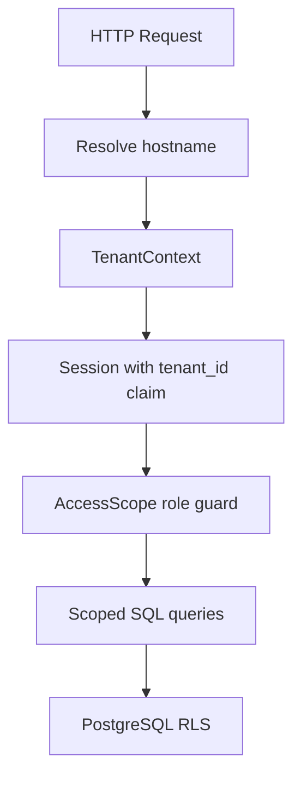

# Multi-Tenancy Architecture

## Topology

One shared FastAPI deployment per environment serves all school hostnames. All tenant data lives in one PostgreSQL database with row-level security (RLS) as the database backstop.

## Three isolation layers

1. **Request** — `TenantMiddleware` resolves tenant from `Host` header against `tenant_domains`. Unknown hosts return 404.
2. **Application** — Every query includes `tenant_id` predicates; `AccessScope` enforces role boundaries within the tenant.
3. **Database** — RLS policies on **school-owned data tables**; application connects as non-owner role with `SET LOCAL app.tenant_id`.

### Registry tables (no RLS)

`tenants` and `tenant_domains` are excluded from RLS. Hostname resolution and the tenant operator read them before request tenant context exists. RLS on those tables would block middleware bootstrap and config reconcile.

## Configuration split

| Concern | Location |
| --- | --- |
| Application code | `school_analytics` repo (immutable image) |
| Tenant business config | `school-analytics-config` repo (`tenants/<key>/<env>.yaml`) |
| Environment release | `environments/<env>/release.yaml` (shared image version) |
| Secrets | Kubernetes secret / secret manager (never in git) |

## Session binding

Session tokens include `tenant_id`. Login scopes email lookup to `(tenant_id, email)`. Hostname, token claim, and database transaction context must agree.
